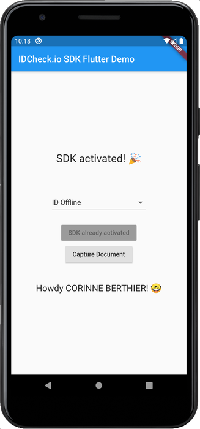
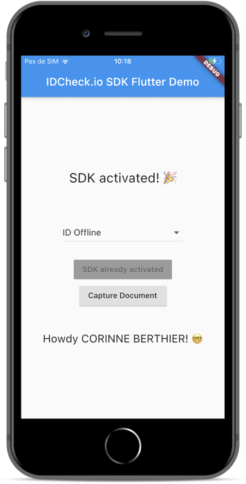

# IDCheck.io Flutter Plugin

Flutter plugin implementation for the IDcheck.io Mobile SDK

 

## Getting Started

This project contains the [`idcheckio`](./idcheckio/) flutter plugin and a sample Flutter application to illustrate how to integrate it.

Please check the plugin [README](./idcheckio/README.md) file for more information about it's integration in your Flutter project.

A few resources to get you started if this is your first Flutter project:

- [Lab: Write your first Flutter app](https://flutter.dev/docs/get-started/codelab)
- [Cookbook: Useful Flutter samples](https://flutter.dev/docs/cookbook)

For help getting started with Flutter, view our
[online documentation](https://flutter.dev/docs), which offers tutorials,
samples, guidance on mobile development, and a full API reference.
